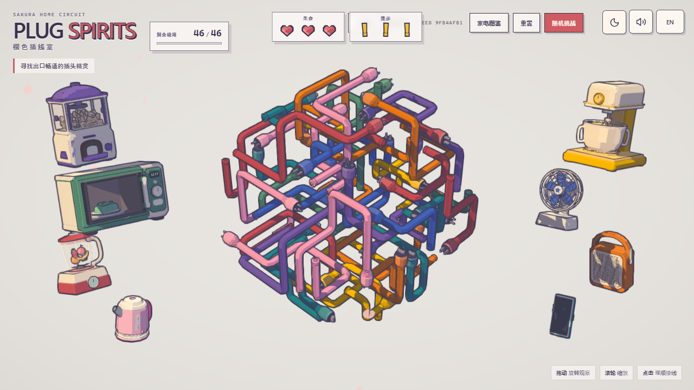
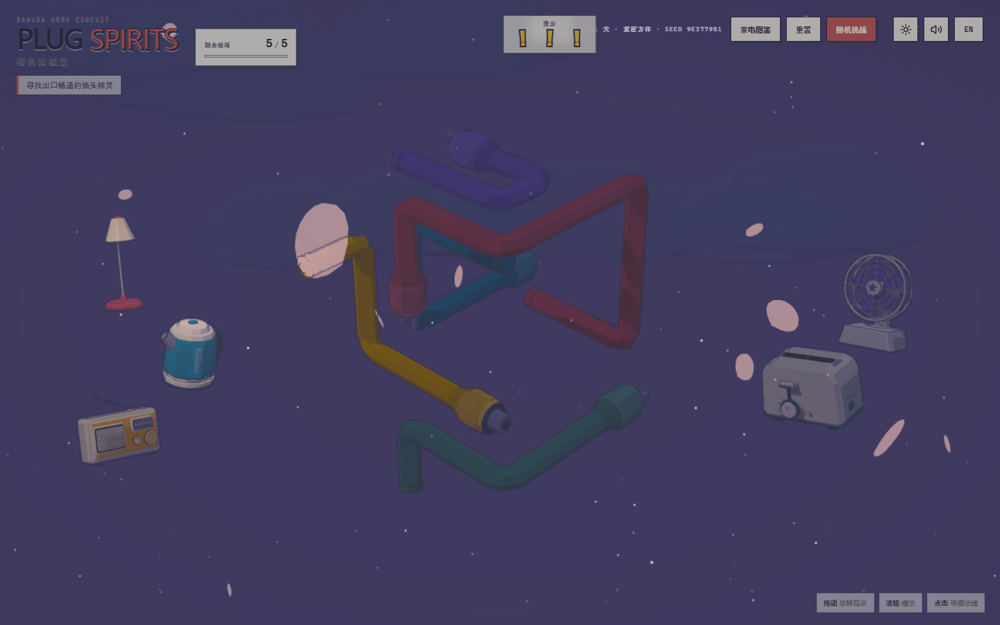

# 樱色插线室

> Sakura Power Supply Room / Plug Cable Spirits

一款采用 Three.js 制作的 3D 空间解线游戏。玩家需要观察缠绕在一起的彩色插头线，判断哪些插头拥有畅通出口，依次抽出线束并为周围的家电恢复供电。



## 项目特色

- **空间解线玩法**：线束沿三维轨道缠绕，错误顺序会被其他线段阻挡，需要从可脱离的插头开始拆解。
- **程序化关卡**：关卡依据种子生成，并通过逆向构造和几何检查保证存在解法。
- **多种挑战模式**：包含普通关卡、随机挑战、双端线束挑战和限时 RUSH 模式。
- **29 台家电**：台灯、电视、收音机、咖啡机、机器人吸尘器等家电拥有独立模型、落地反馈、启动动画、灯光和声音表现。
- **昼夜系统**：白天保持米白樱花色调；夜晚加入星空、动态云层、鼠标提灯、家电功能光和夜间环境声。
- **完整展示系统**：支持家电图鉴、模型自转、昼夜切换、声音开关以及中文/英文界面。
- **桌面与移动端适配**：支持鼠标、触控和不同尺寸视口，并带有自适应画质策略。



## 基本操作

- 按住鼠标左键拖动空白区域：旋转观察线组
- 鼠标滚轮：缩放线组
- 点击可脱离的插头：抽出对应线束
- 拖动左右家电：调整家电位置
- 右上工具栏：切换昼夜、声音和界面语言
- 重置：重新开始当前种子
- 随机挑战：生成新的随机关卡

## 本地运行

环境要求：Node.js 20 或更高版本。

```powershell
npm install
npm run dev
```

开发服务器默认由 Vite 启动，终端会显示实际访问地址。

生产构建：

```powershell
npm run build
```

运行自动化测试：

```powershell
npm test
```

常用专项验证：

```powershell
npm run verify:levels
npm run verify:double-ended
npm run verify:rush
npm run verify:appliance-performance
```

## 技术栈

- TypeScript
- Three.js
- Vite
- Anime.js
- Web Audio API
- Playwright

## 目录说明

```text
src/
  appliances/   家电模型、机械动画与感官配置
  audio/        环境声、交互声和家电音频系统
  game/         主游戏流程与 RUSH 回合
  puzzle/       关卡生成、碰撞和解线规则
  render/       插头、线束与几何渲染
  skill/        家电技能挑战与表现控制
  systems/      HUD、图鉴、场景和交互系统
  theme/        昼夜、星空、提灯和自适应画质
tests/          Playwright 与回归测试
docs/           家电设计、模型规范和项目记录
references/     视觉参考与验收素材
```

## 版本与回退规则

这个仓库作为樱色插线室的正式项目仓库和版本依据：

- `main` 保存当前确认过的最新版本。
- 每次重要更新完成后创建一个版本标签，例如 `snapshot-2026.08.14`。
- 开发中的修改先放在独立分支，验证通过后再更新 `main`。
- `node_modules`、`dist`、测试结果和临时截图不进入仓库。

查看某个旧版本：

```powershell
git fetch --tags
git switch --detach snapshot-2026.08.14
```

从旧版本创建一个可继续修改的恢复分支：

```powershell
git switch -c restore/snapshot-2026.08.14 snapshot-2026.08.14
```

这样不会破坏当前 `main`，也便于比较和选择性恢复文件。

## 当前基准

- 首个正式仓库快照：`snapshot-2026.08.14`
- 生产构建：已通过 `npm run build`
- 项目状态：持续开发中

## 许可与来源

项目的许可与第三方来源说明请查看 [LICENSE](LICENSE) 和 [THIRD_PARTY_NOTICES.md](THIRD_PARTY_NOTICES.md)。
